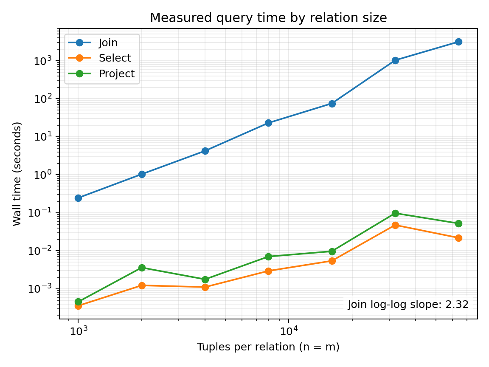

# Performance study

**Measurement machine:** Windows PC, 13th Gen Intel Core i7-1355U. **Language/runtime:** Python 3.12.10. The user ran `python benchmark.py --match-rate 0 --csv measurements.csv` on this machine. The data generator created `R(a,b)` and `S(b,c)` with unique `b` keys that do not match when the match rate is zero. The join is a nested-loop theta join, with an actual counter increment inside the pair-evaluation loop. Timings use `time.perf_counter()` around parsing and evaluation of each query; data generation and file loading occur before the timer. Rows below are actual measurements from the Windows machine, transcribed from the CSV.

I collected these measurements before adding separate per-operator counters. The measured version used aggregate counters inside the same nested-loop join and selection algorithms. The submitted version additionally records each operator’s count, which may add timing overhead. The CSV files preserve the original measurements.

| n | m | Join comparisons | Join wall time (s) | Join output tuples |
| ---: | ---: | ---: | ---: | ---: |
| 1,000 | 1,000 | 1,000,000 | 0.247224 | 0 |
| 2,000 | 2,000 | 4,000,000 | 1.037376 | 0 |
| 4,000 | 4,000 | 16,000,000 | 4.259034 | 0 |
| 8,000 | 8,000 | 64,000,000 | 23.146783 | 0 |
| 16,000 | 16,000 | 256,000,000 | 75.317302 | 0 |
| 32,000 | 32,000 | 1,024,000,000 | 1,030.919855 | 0 |
| 64,000 | 64,000 | 4,096,000,000 | 3,160.947689 | 0 |

| n | Select evaluations | Select time (s) | Select output | Project time (s) | Project output |
| ---: | ---: | ---: | ---: | ---: | ---: |
| 1,000 | 1,000 | 0.0003591 | 1,000 | 0.0004562 | 1,000 |
| 2,000 | 2,000 | 0.0012313 | 2,000 | 0.0036166 | 2,000 |
| 4,000 | 4,000 | 0.0011119 | 4,000 | 0.0017781 | 4,000 |
| 8,000 | 8,000 | 0.0029609 | 8,000 | 0.0070640 | 8,000 |
| 16,000 | 16,000 | 0.0054443 | 16,000 | 0.0097210 | 16,000 |
| 32,000 | 32,000 | 0.0477149 | 32,000 | 0.0977101 | 32,000 |
| 64,000 | 64,000 | 0.0219658 | 64,000 | 0.0525520 | 64,000 |

## 1. Comparisons

For a nested-loop join, each of the `n` R tuples is paired with every one of the `m` S tuples. The expected count is exactly `n × m`. Every row above matches: for example, `64,000 × 64,000 = 4,096,000,000` and the measured counter was exactly `4,096,000,000`. There is no discrepancy. The counter measures evaluations, independent of whether pairs match.

## 2. Join timing and log-log slope

A least-squares fit of log(time) against log(n) for all seven join measurements gives a slope of **2.32**. This is close to, but above, the theoretical slope of **2** expected from `n × n` pair comparisons. A fit restricted to 1,000–16,000 gives **2.10**. The 32,000 point took 1,030.9 seconds, much higher than a smooth continuation of the earlier seconds-per-pair values; the reason has not been established. The 64,000 point took 3,160.9 seconds. The comparisons still grow exactly quadratically, while wall time also reflects machine load, runtime effects, and memory behaviour. This is an inference about possible causes, not a diagnosis of the 32,000 result.

## 3. Select and project

`select[a>=0](R)` evaluates its predicate once per row; its measured counter is exactly `n` at every size. `project[a](R)` also visits `n` input rows. Both times are far below the join times because they do not inspect `n × m` pairs. Individual sub-millisecond select/project times are noisy and should not be interpreted as a precise slope without more repetitions; the 64,000 times are even lower than the 32,000 times, showing measurement variability. Projection uses hash buckets to locate possible duplicate outputs but calls the engine's explicit tuple-equality function to decide duplication.

## 4. One-million-by-one-million prediction

The nested loops would evaluate exactly `1,000,000 × 1,000,000 = 1,000,000,000,000` pairs. Using the largest measured run as a seconds-per-pair estimate, and assuming the zero-match cost per pair stays similar, the prediction is `3,160.947689 × (1,000,000 / 64,000)^2 = 771,716 seconds`, or approximately **8.9 days**. This is an extrapolation, not a measurement. The earlier 16,000 point instead predicts `75.317302 × (1,000,000 / 16,000)^2 = 294,208 seconds` (about 3.4 days). The wide spread shows that the prediction is uncertain because measured time per pair changed markedly at large sizes. The million-row join was not run.

## 5. Match rate

I ran one additional 4,000-by-4,000 experiment on the same Windows computer with match rate 1, using `python benchmark.py --sizes 4000 --match-rate 1 --csv match-rate-1.csv`.

| Match rate | Join comparisons | Output tuples | Join wall time (s) |
| ---: | ---: | ---: | ---: |
| 0 | 16,000,000 | 0 | 4.259034 |
| 1 | 16,000,000 | 4,000 | 3.672842 |

Changing match rate did **not** change the comparison count: the nested loops evaluated every pair in both runs. Wall time differed, but the match-rate-1 run happened to be about 0.59 seconds *faster* despite producing 4,000 rows. Matching pairs add output work, while runtime variation and system conditions also affect elapsed time. A single timing for each setting cannot isolate the effect of match rate or establish that higher match rates are inherently faster. With more matches or larger output, appending and retaining result tuples can add time and memory even though the comparison count is unchanged.

## 6. Making a million-row join feasible

A hash join on equality keys could build a lookup structure for one input and probe it for the other, avoiding a trillion pair comparisons; it would require extra memory, careful duplicate and type handling, and a distinct implementation from this deliberately unoptimized nested-loop join. For data larger than memory, partitioning or external-memory processing would also be necessary. These changes are outside this component's implementation scope.
